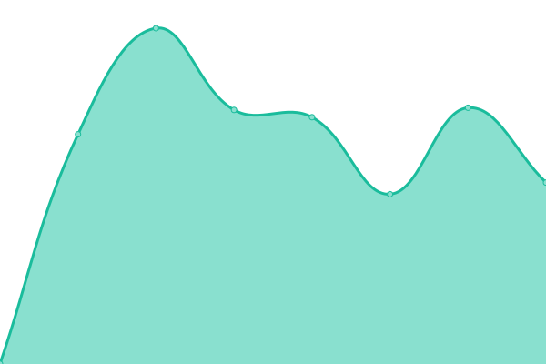

# [📈 Live Status](https://emryl.github.io/upptime-sl): <!--live status--> **🟩 All systems operational**

This repository contains the open-source uptime monitor and status page for [emryl](https://emryl.github.io/upptime-sl), powered by [Upptime](https://github.com/upptime/upptime).

With [Upptime](https://upptime.js.org), you can get your own unlimited and free uptime monitor and status page, powered entirely by a GitHub repository. We use [Issues](https://github.com/emryl/upptime-sl/issues) as incident reports, [Actions](https://github.com/emryl/upptime-sl/actions) as uptime monitors, and [Pages](https://emryl.github.io/upptime-sl) for the status page.

<!--start: status pages-->
<!-- This summary is generated by Upptime (https://github.com/upptime/upptime) -->
<!-- Do not edit this manually, your changes will be overwritten -->
<!-- prettier-ignore -->
| URL | Status | History | Response Time | Uptime |
| --- | ------ | ------- | ------------- | ------ |
|  [SL](https://sl.se) | 🟩 Up | [sl.yml](https://github.com/emryl/upptime-sl/commits/HEAD/history/sl.yml) | 

 1324ms
     
 | 

<a href="https://emryl.github.io/upptime-sl/history/sl">97.77%</a>
    

|  SL Reseplaneraren 01 | 🟩 Up | [sl-reseplaneraren-01.yml](https://github.com/emryl/upptime-sl/commits/HEAD/history/sl-reseplaneraren-01.yml) | 

 149ms
     
 | 

<a href="https://emryl.github.io/upptime-sl/history/sl-reseplaneraren-01">97.78%</a>
    

|  [SL Mina sidor](https://mitt.sl.se) | 🟩 Up | [sl-mina-sidor.yml](https://github.com/emryl/upptime-sl/commits/HEAD/history/sl-mina-sidor.yml) | 

 1408ms
     
 | 

<a href="https://emryl.github.io/upptime-sl/history/sl-mina-sidor">97.78%</a>
    

|  [foretagare.sl.se](https://foretagare.sl.se/foretag/) | 🟩 Up | [foretagare-sl-se.yml](https://github.com/emryl/upptime-sl/commits/HEAD/history/foretagare-sl-se.yml) | 

 1309ms
     
 | 

<a href="https://emryl.github.io/upptime-sl/history/foretagare-sl-se">100.00%</a>
    

<!--end: status pages-->

[**Visit our status website →**](https://emryl.github.io/upptime-sl)

## 📄 License

- Powered by: [Upptime](https://github.com/upptime/upptime)
- Code: [MIT](./LICENSE) © [emryl](https://emryl.github.io/upptime-sl)
- Data in the `./history` directory: [Open Database License](https://opendatacommons.org/licenses/odbl/1-0/)
